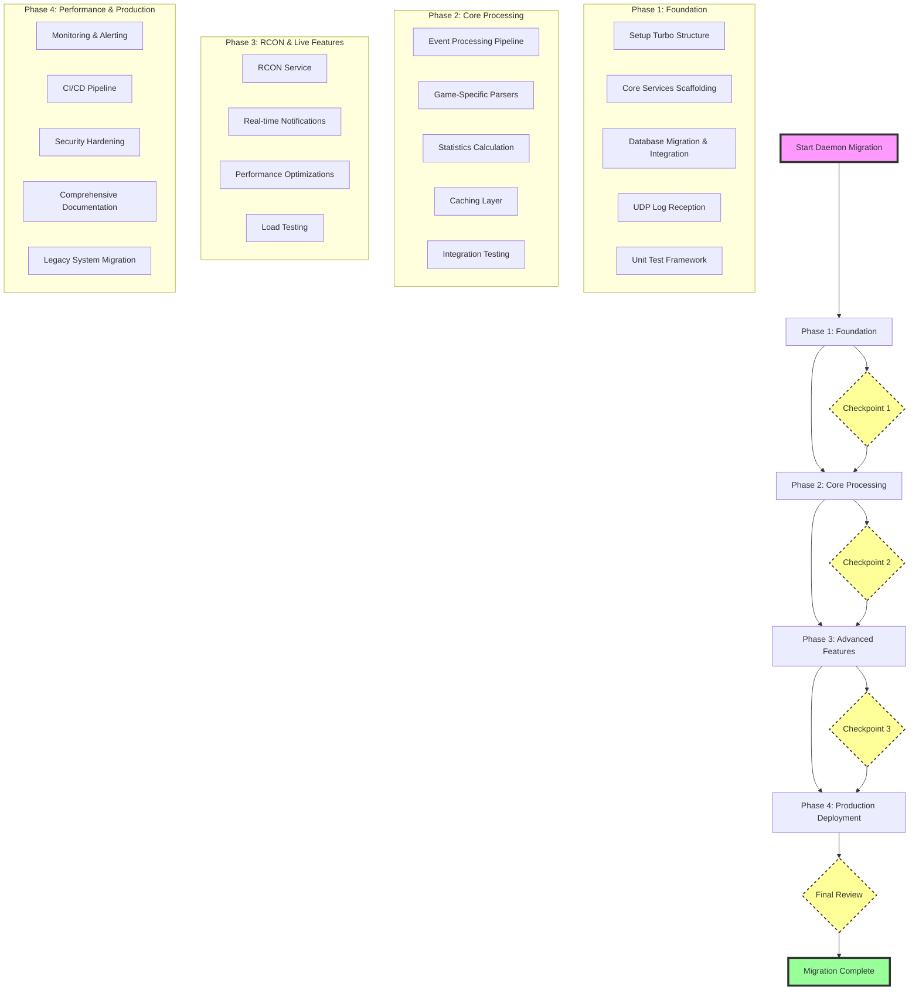

# HLStats Daemon - Migration Plan

## 1. Overview

This document outlines the comprehensive plan to rewrite the legacy Perl-based HLStats daemon into a modern, scalable, and maintainable microservice using TypeScript and Node.js. It serves as the single source of truth for the migration project, detailing everything from high-level architecture to granular implementation steps.

### 1.1. Project Goal

To replace the old HLstatsX Perl program with a robust, testable, and cloud-native solution for real-time game analytics, seamlessly integrated into the existing monorepo.

### 1.2. Migration Phases



## 2. Technology Stack & Architecture

### 2.1. Core Technologies

- **Runtime**: Node.js 20+ with TypeScript 5.x
- **Database**: Prisma ORM with MySQL (utilizing the existing schema)
- **Message Queue**: Redis + BullMQ for robust event processing
- **Caching**: Redis for session management and frequently accessed data
- **Validation**: Zod for compile-time and runtime type safety
- **Testing**: Vitest for unit/integration tests, Supertest for API testing

### 2.2. Service Architecture

The daemon is designed as a set of cohesive microservices, each with a distinct responsibility. This modular approach enhances scalability and maintainability.

- **Log Ingress Service**: Listens for UDP log streams from game servers, performs initial parsing, and enqueues events into Redis.
- **Event Processor Service**: The core of the application. Consumes events from the message queue, applies business logic, and updates the database.
- **RCON Service**: Provides an interface for remote server administration via the RCON protocol.
- **Statistics Service**: Aggregates and calculates real-time statistics, serving them via an API.

For a detailed breakdown of each service's internal structure, refer to the original plan sections.

## 3. Execution Workflow & Implementation Details

This section provides a step-by-step guide for the migration, broken down by phase.

### Phase 1: Foundation (In Progress)

#### 1.1. Prerequisite Validation

- **Environment Check**: Verify Node.js (`>=20`), pnpm (`>=8`), and Docker are installed.
- **Progress Log**: This document, along with `MIGRATION_PROGRESS.md`, will track all activities.

#### 1.2. Directory & Package Setup

1.  **Create `daemon` structure**:
    ```bash
    mkdir -p apps/daemon/{src,tests,scripts,config}
    mkdir -p apps/daemon/src/{services,types,utils,monitoring}
    mkdir -p apps/daemon/src/services/{gateway,ingress,processor,rcon,statistics}
    ```
2.  **Initialize `package.json`**:
    ```json
    {
      "name": "daemon",
      "version": "0.1.0",
      "type": "module",
      "scripts": {
        "dev": "tsx watch src/index.ts",
        "build": "tsc",
        "test": "vitest",
        "test:coverage": "vitest run --coverage"
      },
      "dependencies": {
        "@repo/database": "workspace:*",
        "fastify": "^4.25.0",
        "bullmq": "^5.1.0",
        "ioredis": "^5.3.0",
        "zod": "^3.22.0",
        "winston": "^3.11.0"
      }
    }
    ```
3.  **Configure `tsconfig.json`**:
    ```json
    {
      "extends": "@repo/typescript-config/base.json",
      "compilerOptions": {
        "outDir": "./dist",
        "rootDir": "./src"
      },
      "include": ["src/**/*"],
      "exclude": ["node_modules", "dist"]
    }
    ```
4.  **Run `pnpm install`** within the `apps/daemon` directory.

#### 1.3. Core Service Implementation

- For each service, create the main file, define its types, implement basic functionality, and add initial unit tests.

> **Checkpoint**: All foundational services should be scaffolded with basic passing unit tests.

### Phase 2: Core Processing

#### 2.1. Pre-flight Check

- Ensure all Phase 1 tests are passing.
- Docker services (MySQL, Redis) are running and accessible.

#### 2.2. Event Processing Pipeline

1.  **Define Event Types**: Create Zod schemas and TypeScript types for all game events.
2.  **Implement Queue Manager**: Configure BullMQ queues for different event priorities.
3.  **Build Event Processors**: Develop handlers for each event type, containing the core business logic.
4.  **Add Error Handling**: Implement robust error handling and retry mechanisms.
5.  **Write Integration Tests**: Verify the end-to-end flow from event ingress to database persistence.

### Phase 3: RCON & Live Features

1.  **RCON Service**: Implement full RCON command execution and management.
2.  **Statistics Service**: Build out advanced statistics aggregation and caching.
3.  **Real-time Features**: Implement WebSocket-based real-time updates.
4.  **Performance Tuning**: Optimize queries and processing pipelines.

### Phase 4: Production Deployment

1.  **Critical Validations**:
    - `pnpm audit` for security vulnerabilities.
    - Load testing to ensure performance benchmarks are met.
    - Full integration test suite run.
2.  **Deployment Checklist**:
    - CI/CD pipeline is green.
    - Test coverage exceeds 90%.
    - All documentation is complete and up-to-date.
    - Monitoring and alerting are configured in Grafana/Prometheus.

## 4. Data Models and Security

The data models and security measures will be implemented as defined in the original `MIGRATION_PLAN.md`. This includes enhancing the Prisma schema, defining event data structures with Zod, and implementing robust input validation, authentication, and rate limiting.

## 5. Progress Tracking

Progress will be logged in `apps/daemon/docs/MIGRATION_PROGRESS.md`. The report format should include:

- **Completed Tasks**: What was done.
- **In Progress**: What is currently being worked on.
- **Upcoming**: What is next.
- **Issues & Resolutions**: Any blockers encountered and how they were solved.
